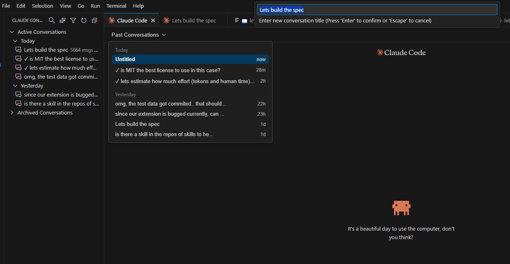
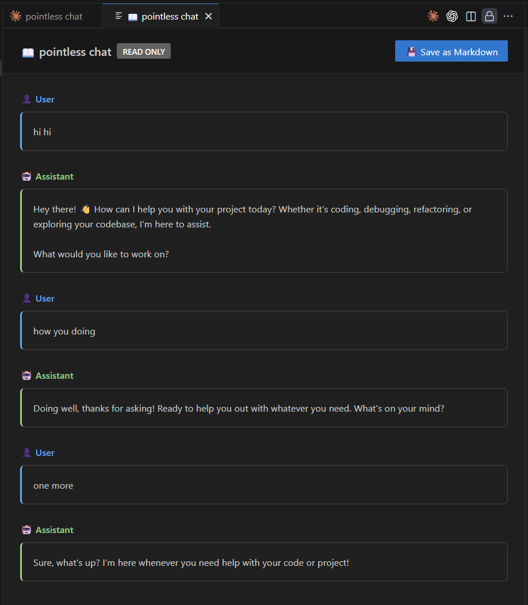
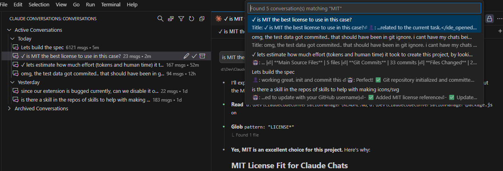

# Claude Chats

> **Looking to rename Claude Code conversations? You found it!**
> This is the **first and only extension** that truly renames Claude Code conversations.

**Tired of generic conversation titles?** Claude Chats actually modifies the underlying `.jsonl` data - not just display names. Your renamed conversations persist in Claude Code itself, everywhere they appear.

## What Makes This Different?

🎯 **True Data Modification** - Edits the actual `.jsonl` files, not cosmetic UI changes
🎯 **Persists in Claude Code** - Renamed conversations show everywhere in VS Code
🎯 **First-of-its-kind** - No other extension modifies Claude Code conversation data
🎯 **Pixel-Perfect Matching** - Conversations display exactly like Claude Code (same titles, timestamps, sorting)
🎯 **Plus Full Management** - Archive, organize, and delete conversations too

## Features

### 🗂️ Conversation Organization
- **Tree View** - Browse all your Claude Code conversations in a dedicated sidebar
- **Group by Project or Date** - Organize conversations the way you work
- **Smart Search** - Fast full-text search with progress feedback, scoped to current project

### ✏️ True Conversation Renaming
- **Actually modifies the conversation data** - not just a display name in this extension
- **Automatic maintenance** - File watcher keeps renamed titles working during active conversations
- Changes persist in Claude Code's native interface
- Renames appear everywhere: sidebar, conversation history, recent files
- Uses summary-based renaming with automatic `leafUuid` updates
- Smart validation prevents naming conflicts
- Rename directly from tree view or command palette

### 📖 Beautiful Conversation Viewer
- **Custom chat-like viewer** - Opens instead of raw `.jsonl` files
- **Read-only design** - Clear "READ ONLY" badge indicates archived conversations
- **One-click markdown export** - "Save as Markdown" button in header
- **Message bubbles** - User (blue) and Assistant (green) messages with icons
- **Theme support** - Automatically adapts to VS Code light/dark themes
- **Responsive layout** - Works perfectly on narrow windows

### 📦 Archive & Restore
- Archive old conversations to keep your workspace clean
- Restore archived conversations when you need them
- Configurable archive location
- Optional confirmation dialogs for safety

### 🛡️ Safe & Reliable
- Automatic backups before any modifications
- Non-destructive operations
- Works with existing Claude Code conversation structure

### ⚡ Quick Access
- **Command Palette** - Access all features via `Ctrl+Shift+P` (or `Cmd+Shift+P` on Mac)
- **Context Menus** - Right-click conversations for quick actions
- **Inline Actions** - Rename and archive with one click

## In Action

### Organization & Management

The extension displays your conversations in an organized tree view (left sidebar), grouped by when you last chatted (Today, Yesterday, Past week, etc.). Your renamed titles persist in Claude Code's native interface (right sidebar), creating a seamless experience across the editor.

### Beautiful Conversation Viewer

Click any conversation to open it in a beautiful read-only viewer with message bubbles, syntax highlighting, and a one-click markdown export button. The viewer automatically adapts to your VS Code theme.

### Fast Search

Quickly find conversations with full-text search across conversation titles and content. Search results are highlighted and scoped to the current project for fast, relevant results.

## Why Claude Chats?

### The Problem
Working with Claude Code generates many conversations, but Claude Code doesn't provide built-in tools to:
- **Rename conversations** - they all show as generic titles based on first message
- Find that conversation where you solved a specific problem
- Keep track of which projects have active discussions
- Clean up old or completed conversations

### The Solution
**Claude Chats is the first and only extension that truly renames Claude Code conversations.** Unlike other tools that only change display names in their own UI, Claude Chats:

✅ **Modifies actual conversation data** in Claude Code's `.jsonl` files
✅ **Changes persist in Claude Code** - not just in this extension
✅ **Works everywhere** - renamed conversations show with new titles throughout VS Code
✅ **Plus archiving and organization** - complete conversation management

This is the real deal - actual data modification, not cosmetic changes.

## Installation

### From Source (Development)

1. Clone this repository
2. Run `npm install`
3. Run `npm run compile`
4. Press F5 to launch Extension Development Host

### From Marketplace

1. Open VS Code
2. Go to Extensions (`Ctrl+Shift+X` or `Cmd+Shift+X`)
3. Search for "Claude Chats"
4. Click Install

Or install directly from the [VS Code Marketplace](https://marketplace.visualstudio.com/items?itemName=your-publisher-name.claude-chats)

## Usage

### View Conversations

1. Click the "Claude Conversations" icon in the Activity Bar
2. Browse conversations grouped by project
3. Expand "Active Conversations" or "Archived Conversations"

### Rename a Conversation

**From Tree View:**
1. Right-click a conversation
2. Select "Rename"
3. Enter new title

**From Command Palette:**
1. Open a `.jsonl` conversation file
2. Press `Ctrl+Shift+P`
3. Run "Claude Code: Rename Current Conversation"

### Mark as Done/Undone

**From Tree View (Quick):**
1. Click the ✓ Toggle Done icon button on any conversation
2. Adds or removes ✓ prefix to track completed conversations

**From Tree View (Right-click):**
1. Right-click a conversation
2. Select "Toggle Done"

This marks conversations as complete without archiving them, useful for keeping finished chats accessible.

### Archive a Conversation

**From Tree View (Quick):**
1. Click the 📦 Archive icon button on any conversation
2. Confirm archive

**From Tree View (Right-click):**
1. Right-click a conversation
2. Select "Archive"
3. Confirm archive

**From Command Palette:**
1. Open a `.jsonl` conversation file
2. Press `Ctrl+Shift+P`
3. Run "Claude Code: Archive Current Conversation"

### Restore from Archive

1. Expand "Archived Conversations" in tree view
2. Right-click an archived conversation
3. Select "Restore"

### Delete a Conversation

1. Right-click a conversation
2. Select "Delete"
3. Confirm deletion (cannot be undone)

## Extension Settings

This extension contributes the following settings:

* `claudeChats.archiveLocation` - Location for archived conversations (default: `~/.claude/projects/_archive`)
* `claudeChats.createBackups` - Create backup files before modifying conversations (default: `true`)
* `claudeChats.confirmArchive` - Show confirmation dialog before archiving (default: `true`)
* `claudeChats.showArchivedInTree` - Show archived conversations in the tree view (default: `true`)
* `claudeChats.groupBy` - How to group conversations: `project` or `date` (default: `project`)
* `claudeChats.showEmptyConversations` - Show conversations with no actual user content (default: `false`)

## Commands

* `Claude Code: Rename Current Conversation` - Rename the currently active conversation
* `Claude Code: Archive Current Conversation` - Archive the currently active conversation
* `Claude Code: Show Conversation Manager` - Open the conversation tree view
* `Claude Code: Refresh Conversations` - Refresh the conversation list

## Requirements

- VS Code 1.95.0 or higher
- Claude Code extension installed

## How It Works (Technical Details)

### True Rename - Not Just Display Names

**Important:** This extension modifies the actual `.jsonl` conversation files that Claude Code uses. When you rename a conversation:

1. **Reads the `.jsonl` file** - Your conversation data in Claude Code's format
2. **Finds the first user message** - Claude Code uses this as the conversation title
3. **Modifies the message content** - Changes the actual data
4. **Writes back to the file** - Updates the `.jsonl` file
5. **Creates automatic backup** - Saves `.jsonl.backup` before any changes

**This means:**
- ✅ Renames persist in Claude Code's native interface
- ✅ Changes appear in Claude Code's conversation list
- ✅ New titles show everywhere VS Code displays the conversation
- ✅ No orphaned messages or hacks - clean data modification
- ⚠️ This is a workaround until Anthropic adds official rename support

### Archive Implementation

- Moves `.jsonl` file to `~/.claude/projects/_archive/[project-name]/`
- Optionally adds ✓ prefix to mark as done
- Only allows archiving if conversation is not currently open
- VS Code no longer shows it in conversation list

### File Safety

- Always creates `.backup` files before modification
- Validates JSON structure before writing
- Handles file locks gracefully
- Atomic operations where possible

## Known Issues

See [GitHub Issues](https://github.com/yourusername/claude-chats/issues) for current known issues.

## Release Notes

See [CHANGELOG.md](CHANGELOG.md) for detailed release notes.

### 0.1.0

Initial release of Claude Chats:
- Conversation tree view with project/date grouping
- Rename conversations with validation
- Archive and restore functionality
- Delete conversations
- Configurable settings
- Automatic backups

## Troubleshooting

### Conversation still appears after archiving

- Make sure the conversation is not open in any VS Code window
- Try refreshing the tree view (click refresh icon)
- Reload VS Code window (`Ctrl+Shift+P` → "Developer: Reload Window")

### "No conversations found"

- Check that Claude Code extension is installed
- Verify conversations exist in `~/.claude/projects/[project-name]/`
- Check file permissions

## Contributing

Found a bug or have a feature request? Please open an issue on [GitHub](https://github.com/yourusername/claude-chats/issues).

## Disclaimer

This extension modifies Claude Code conversation files (`.jsonl` format) to provide rename functionality. Automatic backups are created before modifications. This is an unofficial workaround until Anthropic adds native rename support. Use at your own risk - you are responsible for your data.

## License

[MIT](LICENSE)

---

**Enjoy using Claude Chats!** If you find this extension helpful, please consider leaving a review on the [VS Code Marketplace](https://marketplace.visualstudio.com/items?itemName=your-publisher-name.claude-chats).
